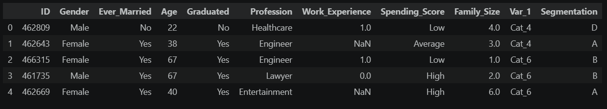
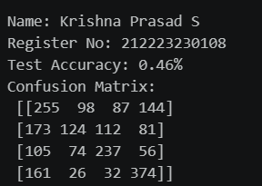
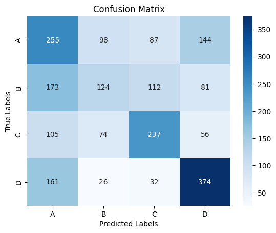
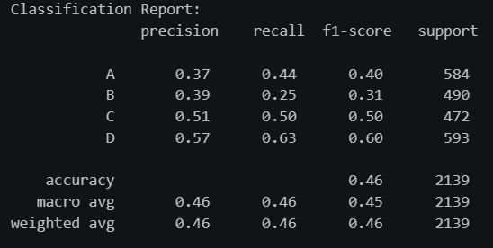
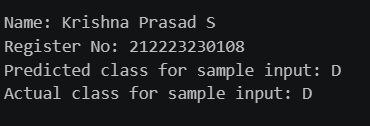

# Developing a Neural Network Classification Model

## AIM
To develop a neural network classification model for the given dataset.

## THEORY
An automobile company has plans to enter new markets with their existing products. After intensive market research, they’ve decided that the behavior of the new market is similar to their existing market.

In their existing market, the sales team has classified all customers into 4 segments (A, B, C, D ). Then, they performed segmented outreach and communication for a different segment of customers. This strategy has work exceptionally well for them. They plan to use the same strategy for the new markets.

You are required to help the manager to predict the right group of the new customers.

## Neural Network Model
Include the neural network model diagram.

## DESIGN STEPS
### STEP 1: 

Load dataset

### STEP 2: 

Process the Dataset

### STEP 3: 

Split features and target

### STEP 4: 

Define Neural Network 

### STEP 5: 

Initialize the training loop and train the model


### STEP 6: 

Compute metrics as result


## PROGRAM

### Name: Krishna Prasad S

### Register Number: 212223230108

```python
class PeopleClassifier(nn.Module):
    def __init__(self, input_size):
        super(PeopleClassifier, self).__init__()
        #Include your code here
        self.fc1 = nn.Linear(input_size, 32)
        self.fc2 = nn.Linear(32, 16)
        self.fc3 = nn.Linear(16, 8)
        self.fc4 = nn.Linear(8, 4)

    def forward(self, x):
      #Include your code here
      x = F.relu(self.fc1(x))
      x = F.relu(self.fc2(x))
      x = F.relu(self.fc3(x))
      x = self.fc4(x)
      return x

        
# Initialize the Model, Loss Function, and Optimizer

def train_model(model, train_loader, criterion, optimizer, epochs):
  #Include your code here
  model.train()
  for epoch in range(epochs):
    for inputs, label in train_loader:
      optimizer.zero_grad()
      outputs = model(inputs)
      loss = criterion(outputs, label)
      loss.backward()
      optimizer.step()
```

### Dataset Information



### OUTPUT

## Confusion Matrix




## Classification Report



### New Sample Data Prediction



## RESULT
Thus, a Neural Network Classification Model for the given dataset has been developed.
